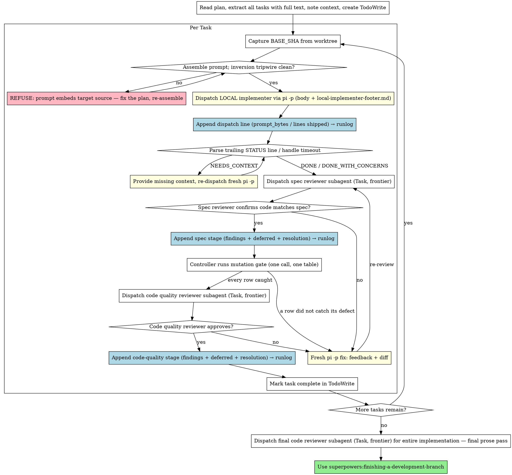

# Local-Subagent-Driven Development

A variant of **superpowers:subagent-driven-development**. Identical orchestration and identical
two-stage review — **the only change is who writes the code.** The implementer runs as a local
headless `pi -p` process inside the task worktree (free, local tokens) instead of a frontier
Claude Task subagent. Planning, both reviewers, and finishing all stay on the frontier, exactly
as the base skill configures them.

If you have not read **superpowers:subagent-driven-development**, read it first — every principle
there (fresh context per task, spec-then-quality review, continuous execution, never parallel
implementers, never skip review loops) applies here unchanged. This document repeats only what
differs.

**Core principle:** Frontier brain (plan + two-stage review), local hands (implement) — the
typing is free, the judgment is not.

**Continuous execution:** Same as base — do not pause to check in between tasks. Stop only on a
BLOCKED you cannot resolve, genuine ambiguity, or all tasks complete.

## When to Use

Use this instead of base subagent-driven-development when **all** of these hold:
- You have a well-specified plan with mostly independent tasks, whose task sections conform to
  [Plan Requirements](#plan-requirements-the-writing-plans-handoff) (same precondition as base).
- A local `pi -p` model is configured and reachable (see Local Dispatch Protocol).
- You want implementation tokens off the frontier meter.

If the local model isn't available, or the tasks need frontier-level reasoning to *implement*
(not just to review), use base **superpowers:subagent-driven-development** instead.

## Plan Requirements (the writing-plans handoff)

This skill executes plans created by **superpowers:writing-plans**. That is a handoff, and this
section is the contract on it. When you write or review such a plan, every task section must:

**Specify behaviour, interfaces, and the test cases — never the implementation.**

- **Behaviour:** what the task must do in observable terms — inputs, outputs, errors, side effects.
- **Interfaces:** the public contract — signatures, types, and the file paths the task creates or
  modifies.
- **Test cases:** the concrete cases that encode correctness (inputs, expected results, how they
  run). These are spec, not implementation: the test cases are the thing a review should be strict
  about.

No module source, no function bodies, no "write file X with this content." The frontier specifies
what correct looks like; Blueberry writes the code that satisfies it.

### Why — read before you "fix" this

Measured on the Theseus surrogate-replication run (theseus #26–#30, 2026-09-04/05), where every
plan embedded complete module source and Blueberry transcribed rather than implemented:

| | |
|---|---|
| Billable frontier tokens | 6,684,954 |
| Lines shipped | 2,804 |
| Frontier lines in dispatch prompts + plans | 8,188 |
| Frontier lines of production code authored for dispatch | 1,439 |
| Review subagent tokens | 2,312,111 (35% of billable) |

Roughly three lines of frontier scaffolding per line shipped. The compounding is the expensive
part: because the source lived in the plan, every review finding cost a full frontier re-authoring
**plus** a rebuilt dispatch prompt (19–36 KB each) **plus** a verbatim-diff verification.
`replication_batch.py` went through three such rounds.

**The failure mode is invisible in the status line.** A transcriber never escalates — there is
nothing for it to be blocked *on* — so a fully inverted run reports as a flawless one: 16 dispatches,
12 `DONE`, 2 `DONE_WITH_CONCERNS`, 0 `BLOCKED`, 0 `NEEDS_CONTEXT`, zero escalations. The inversion
ran two days without being noticed because every signal the pipeline reports looked normal.
"No escalations" is not evidence of health; it is equally consistent with the local model doing no
thinking at all (see #31 for the pre-dispatch tripwire).

**Interaction with #29:** if the review bar grades explanatory prose per round, a 27B model at
`--thinking minimal` cannot meet it and plans will drift back to embedded source no matter what
this section says. These two land together or not at all.

## The Process

Identical to base, except the implementer (initial dispatch and every fix re-dispatch) is a
local `pi -p` call instead of a Task subagent. Both reviewers remain Task subagents. Steward adds
two things on top: every dispatch carries the [Steward Dispatch Payload](#steward-dispatch-payload)
(issue + its Decisions & Defaults + `DECISIONS.md` + ledger protocol — deliberately not the brief),
and each resolved review stage is persisted to
the [runlog](#capturing-the-review-trail-runlog) instead of dying in-session (the `→ runlog`
notes in the graph). Two controller-side checks bracket the implementer: the
[inversion tripwire](#pre-dispatch-inversion-check) before the dispatch, and the
[mutation gate](#mutation-gates--one-call-one-table) after the spec stage. Both are mechanical,
both run as one call, and neither is ever dispatched to the local model.



## Local Dispatch Protocol

This is the one section with no equivalent in the base skill. It defines exactly how the
implementer (and its fixes) run locally.

### Building the prompt

1. **Assemble the steward context pack** (see [Steward Dispatch Payload](#steward-dispatch-payload)
   below). This is the **settled** decision context the implementer needs to resolve ambiguity
   without asking: the issue body (with its Decisions & Defaults excerpts), the target repo's
   `DECISIONS.md` (if present), and this skill's `./ledger-protocol.md` — **and not the project
   brief** (see the section for why). It goes **first**, before the implementer body.
2. **Read the unchanged upstream implementer body** from the installed base skill:
   `superpowers:subagent-driven-development/implementer-prompt.md`. Use the text *inside* its
   `prompt: |` block — the same body you would have put in a Task subagent. Fill in Task
   Description (full text from the plan/issue), Context (scene-setting), and working directory
   exactly as the base template instructs. Do **not** copy or edit that file into this repo.
3. **Append this skill's footer**, `./local-implementer-footer.md`, verbatim. The footer
   reconciles the interactive base body with headless execution and defines the machine-parseable
   `STATUS:` contract. It stays last — it says "read this last."
4. **Run the inversion tripwire on the assembled prompt** before it goes anywhere
   (see [Pre-dispatch Inversion Check](#pre-dispatch-inversion-check)). A prompt that already
   contains the module it is asking for is not a dispatch; it is transcription with extra steps.
5. Write the assembled prompt to a temp file and feed it to pi **on stdin**
   (`pi -p ... < "$PROMPT"`). Do **not** deliver it with `@file`: pi treats `@file` content as
   an untrusted *attachment*, not as the operator's prompt, and refuses to follow the instructions
   inside it — the run dies with a refusal instead of implementing.

   Argv (`pi -p "$(cat "$PROMPT")"`) is also a trusted channel and works for small packs, but it
   is **not** bounded by `ARG_MAX` (2MB) as you might assume: Linux caps any *single* argument at
   `MAX_ARG_STRLEN` = 32 pages = **131072 bytes**, and the whole prompt is one argument. Past that
   the exec fails with `E2BIG` before pi ever starts — which looks exactly like the silent no-op
   run described below, with an empty `out.txt` and no session file to diagnose. A fix re-dispatch
   appends a full `git diff "$BASE_SHA"..HEAD`, so this ceiling is genuinely reachable. Stdin has
   no such limit; prefer it always.

### Steward Dispatch Payload

This is steward's extension over the base skill: every dispatch (initial and every fix re-dispatch)
carries the **settled** decision context the implementer needs to resolve ambiguity without asking
— and **nothing more**. The controller assembles the pack; it is prepended to the implementer body
in this order:

1. **This issue** — the issue body being implemented, including its *Decisions & Defaults*
   excerpts, verbatim. Per the decomposition protocol each issue already carries the decisions
   relevant to *this* task; that excerpt — not the whole brief — is how settled decisions reach the
   implementer.
2. **Standing decisions** — the contents of the target repo's root `DECISIONS.md` if it exists;
   otherwise the literal line `DECISIONS.md: none yet — ledger every assumption` (graceful
   degradation, per `docs/DECISION-LIFECYCLE.md`).
3. **Decision & ledger protocol** — `./ledger-protocol.md` verbatim, the implementer-facing
   capsule of the decision lifecycle (resolution ladder, hard-stop class, ledger entry format).

**Deliberately *not* included: the project brief.** Injecting the whole brief works against the
point of decomposition — **context isolation**. The brief is where decisions get *argued*; by the
time an issue is dispatched, those decisions are *made*. Handing the implementer the brief invites
it to re-read and re-litigate settled choices — wasted effort at best, drift at worst. Settled
decisions must arrive **already settled**, as the issue's Decisions & Defaults excerpts and
`DECISIONS.md` entries, in directive form. If a decision the task needs is in neither, that is a
decomposition gap: the implementer takes a reversible default and ledgers it, or stops with
`NEEDS_CONTEXT` — it does **not** go spelunking in the brief. (Standing decision, steward
`DECISIONS.md` 2026-07-04; supersedes the "brief" item in issue #6 and brief C3.)

The issue and `DECISIONS.md` live in the **target repo**; `ledger-protocol.md` ships with this
skill so the protocol is present even when the target repo has no steward files yet. Assemble each
behind a clear `## ` heading so the implementer can tell them apart, e.g.:

```bash
CONTEXT_PACK=$(mktemp)
{
  printf '# Dispatch context (read before the task)\n\n'
  printf '## This issue\n\n';      cat "$ISSUE_BODY_PATH"
  printf '\n\n## Standing decisions\n\n'
  if [ -f "$WORKTREE/DECISIONS.md" ]; then cat "$WORKTREE/DECISIONS.md"
  else printf 'DECISIONS.md: none yet — ledger every assumption\n'; fi
  printf '\n\n'; cat "$SKILL_DIR/ledger-protocol.md"
} > "$CONTEXT_PACK"
```

### Invoking

```bash
PROMPT=$(mktemp)
{ cat "$CONTEXT_PACK";                            # steward payload: issue + DECISIONS.md + ledger-protocol (no brief)
  printf '\n\n%s\n\n' "$IMPLEMENTER_BODY_WITH_CONTEXT";
  cat local-implementer-footer.md; } > "$PROMPT"  # footer last — it overrides anything above that assumes a chat

cd "$WORKTREE"
BASE_SHA=$(git rev-parse HEAD)                 # capture BEFORE the run, for the quality reviewer

# Refuse to dispatch a prompt that already contains the target module (#31).
# --target once per file the task says it creates or modifies. Records the
# prompt size for the runlog's ratio line; drop --warn-only at your peril.
CHECK=$("$SKILL_DIR/tools/check-inversion.py" --prompt "$PROMPT" --root "$WORKTREE" \
          --target "$TARGET_1" --target "$TARGET_2") || { echo "$CHECK"; exit 1; }
PROMPT_BYTES=${CHECK##*prompt_bytes=}

# Clear stray HEADLESS implementers only. pi's process title is bare `pi` — its arguments
# are NOT visible to pkill -f — so headless runs are identified by having no tty. (See below.)
for p in $(pgrep -x pi); do
  [ "$(ps -o tty= -p "$p" | tr -d ' ')" = "?" ] && kill -TERM "$p"
done

timeout -k 10 --signal=TERM "$BUDGET_SECONDS" \
  pi -p --thinking low < "$PROMPT" \
  > out.txt 2> err.txt &
TIMEOUT_PID=$!
PI_PID=$(pgrep -P "$TIMEOUT_PID" -x pi)   # the process to kill if YOU need to abort this run
wait "$TIMEOUT_PID"
rc=$?

# Tolerant parse: the model may emit a bare `STATUS: DONE` OR markdown `**Status:** DONE`
# (the upstream Report Format uses the bold form). Match either, normalise to upper-case.
STATUS=$(grep -ioE 'status:[*[:space:]]*(DONE_WITH_CONCERNS|NEEDS_CONTEXT|BLOCKED|DONE)' out.txt \
         | grep -ioE 'DONE_WITH_CONCERNS|NEEDS_CONTEXT|BLOCKED|DONE' | tail -1 | tr a-z A-Z)
HEAD_SHA=$(git rev-parse HEAD)                  # capture AFTER, for the quality reviewer
```

- **Model** — not specified on the command line. Pi's own config (`~/.pi/agent/models.json`)
  selects the local model; let it. Override only by editing that config, not this invocation.
- **`$BUDGET_SECONDS`** — a generous per-task wall-clock cap (start ~600–1200s; tune per plan).
  A week of smooth runs shows a slow `pi -p` is usually thinking, not hung — so budget long and
  let it work rather than killing early.
  `pi -p` has **no internal timeout**, so this wrapper is mandatory.
- **`--signal=TERM` with `-k 10`, never bare `--signal=KILL`.** This is critical. A hard SIGKILL
  severs pi mid-request and orphans **both** the pi process **and** the LM Studio server-side
  generation; the orphaned generation then wedges the local model so every *subsequent* dispatch
  hangs on its first inference (frozen, empty output) until you kill the strays. SIGTERM lets pi
  abort the generation and clean up its children; `-k 10` is a 10s backstop if it ignores TERM.
  The defensive tty-filtered sweep before each dispatch clears any orphan a previous run
  left behind. (This was the single biggest failure mode in the e2e shakedown — see brief §11.)
- **Identify headless pi by its *tty*, not by its arguments.** This is the one that has been
  got wrong twice, so verify it against a live process before you trust any pattern.

  **pi's command line is the single word `pi`.** It is a Node script that rewrites its process
  title, so `-p`, `--thinking`, `--session-dir` and everything else are **invisible to `pkill -f`**.
  Confirmed against a running dispatch:

  ```
  $ ps -eo pid,tty,args | awk '$3=="pi"'
  3434091 ?        pi                  # <- the entire command line

  pgrep -x pi                -> 3434091      # matches
  pgrep -f '(^|/)pi -p'      -> (nothing)    # matches NOTHING
  ```

  So any `pkill -f` pattern built around `pi -p` is **inert** — it never kills the orphan it was
  written to kill, and it looks safe only because it does nothing. (Worse, an *unanchored*
  `pkill -f 'pi -p'` is not inert: it matches the dispatch script's own shell, whose command line
  does contain that text, and kills the run from inside itself — reproduced, exit 144.)

  `pkill -x pi` matches by process *name* and therefore does work — which is why it was the
  original instruction — but it is indiscriminate: it also kills an interactive pi session the
  human has open in another terminal, out from under them.

  The discriminator that actually separates the two is the **controlling terminal**: a headless
  dispatch has `tty=?`, an interactive session has a real pts. Hence the loop in the invocation
  above. Caveat: a human running their *own* headless `pi -p` on this box would also have no tty
  and would be swept — rare, but say so rather than pretend the filter is exact.

- **To abort the run you started, kill `$PI_PID` — do not sweep.** The invocation captures the
  pid; killing it directly needs no pattern matching and cannot touch anyone else's session.
  Pattern sweeps are only for orphans left by an *earlier* run, whose pid you no longer have.
- **`--thinking low` is the dispatch default, and always pass the flag explicitly.** The failure
  it guards against is a **runaway reasoning loop**: thinking tokens and output tokens come out of
  one fixed **16,384-token output budget**, and the model can spend the entire budget reasoning
  without ever emitting its first tool call. The run then exits "cleanly" — rc 0, no commits, no
  status line, nothing in `out.txt`. The signature in the session file is unmistakable:
  `"stopReason": "length"`, `usage.output` exactly `16384`, and a final message whose content
  parts are `['thinking']` and nothing else.

  **The burn is task-dependent, not simply level-dependent** — measured, not assumed. On one real
  implementation task, `xhigh` burned the full budget and `medium` burned it too; `low` completed.
  But on a trivial one-tool-call task, `high` finished in 37s using **71 output tokens with 64
  spent on thinking** — three orders of magnitude of headroom. So a higher level does not
  deterministically burn the budget; it raises the probability that a task the model finds hard or
  underspecified tips into the loop. Since dispatches here are real implementation tasks, default
  `low`. Climb the ladder (`off, minimal, low, medium, high, xhigh, max`) one rung at a time for a
  task that demonstrably needs it, and drop back on the first `length` stop.

  **Pass `--thinking` explicitly on every dispatch.** The level is read from
  `~/.pi/agent/settings.json` (`defaultThinkingLevel`) when the flag is absent, and on the
  reference host that default is `xhigh` — the exact setting that produced the burn. Never rely on
  the ambient config.

  Note that the level you dispatched with is **not** recoverable from the session file — the
  `thinkingLevel` it records tracks neither the flag nor the settings default (observed as `"off"`
  on runs dispatched at both `xhigh` and `medium`). Log the level in the runlog, or you cannot
  reconstruct which rung failed.

### Reading the result (spike + e2e hardened — see brief §11)

- **Normal exit (`rc == 0`):** branch on `$STATUS` per "Handling Implementer Status" below.
- **Timeout (`rc == 124`, or `143` if TERM-terminated):** `pi -p` **buffers all stdout until
  exit**, so a killed run yields empty `out.txt` even if work landed. **Do not trust stdout.**
  Inspect git instead: `git -C "$WORKTREE" log --oneline "$BASE_SHA"..HEAD` and `git status`. If
  commits landed and the tree is clean, salvage as `DONE_WITH_CONCERNS` and send to review (the
  reviewer is the real gate). Otherwise sweep tty-less `pi` processes, then treat as `BLOCKED` and
  re-dispatch once with a larger budget; if it times out again, escalate. **A timeout is also your
  cue to clear orphans before the next dispatch**, or it too will hang.
- **Clean exit, but no commits and no output:** don't guess — read the **`stopReason`** from pi's
  session file. A no-output failure is opaque from the outside (empty `out.txt` looks identical
  for a refusal, a token-budget exhaustion, and a provider error); the session file is the only
  place the run says why it stopped:

  ```bash
  # Sessions are stored in a PER-PROJECT subdirectory (the cwd path, slugified) — a flat
  # ~/.pi/agent/sessions/*.jsonl glob matches nothing and silently yields an empty $SESSION.
  SESSION=$(find ~/.pi/agent/sessions -name '*.jsonl' -printf '%T@ %p\n' 2>/dev/null \
            | sort -rn | head -1 | cut -d' ' -f2-)
  grep -o '"stopReason"[[:space:]]*:[[:space:]]*"[^"]*"' "$SESSION" | tail -1
  ```

  Scope it to the worktree you dispatched into when other pi sessions may be running concurrently
  — `find ~/.pi/agent/sessions -path "*$(echo "$WORKTREE" | tr / -)*" -name '*.jsonl'` — otherwise
  "newest session anywhere" can hand you an unrelated project's run.

  Interpret it: a length/max-tokens stop means the output budget ran out — usually thinking burn
  (see `--thinking` above); lower the thinking level and re-dispatch fresh. An error stop means
  the provider/model faulted — check LM Studio, clear orphans, re-dispatch. An abort means
  something killed the run. Only after reading it do you pick between re-dispatch and escalation.
- **No `STATUS:` match on a clean exit (but work landed):** treat as `DONE_WITH_CONCERNS` and
  proceed to review — let the spec reviewer catch any gap. Never block the loop on a
  missing/garbled status line.

### Fix loop — fresh session, never resume

When a reviewer finds issues, **re-dispatch a fresh `pi -p`** — do **not** reuse `--session-id`.
(Spike §11: resuming a pi session that already holds tool-call history with tools enabled hangs
hard.) Statelessness is the rule, not a fallback. Give the fresh run enough to fix without prior
chat memory:

**Prose-bar findings never enter this loop.** Per-round reviewers report them under
`Deferred (final pass)` and they go straight to the runlog — no fix dispatch, no re-review, no
cycle counting. Only blocking (correctness) findings are "issues" here. The deferred list rides
to the final pass, which is the only place prose gets fixed (see [review-bar.md](./review-bar.md)).

- The original task description (same body).
- The reviewer's specific findings (verbatim, with file:line references).
- `git -C "$WORKTREE" diff "$BASE_SHA"..HEAD` so it sees exactly what was built.
- The same footer (it will read current files in the worktree directly).

Dispatch the fix run with the **same Invoking discipline** as above (tty-filtered orphan
sweep first, prompt on stdin not `@file`, `--thinking low`,
`--signal=TERM -k 10`, tolerant status parse). The fix prompt carries a full
`git diff "$BASE_SHA"..HEAD`, so it is the dispatch most likely to blow the argv ceiling —
another reason stdin is the default. After it commits, advance `HEAD_SHA` and re-review.
The cwd worktree guarantees commits land on the task branch.

### Convergence guard

A weak local model may not converge. **Cap the fix↔review cycles per reviewer at 3.** On
exhaustion, **stop and escalate to the human** with the diff and the outstanding findings — do not
keep bouncing or ship unreviewed code. (Acceptance: an oversized task surfaces here rather than
silently shipping.)

The cap counts **blocking** cycles only; deferred prose items never count. The final pass gets
**one** fix dispatch for its rewrites — they are mechanical, verbatim applications of the
reviewer's exact instructions — verified by diff-match against those instructions, not by a second
prose round. No second prose round, ever: that is the cost this split exists to remove.

## Pre-dispatch Inversion Check

`tools/check-inversion.py` refuses a dispatch whose prompt already carries the module it is asking
for. Run it on the assembled prompt, before pi sees it:

```bash
"$SKILL_DIR/tools/check-inversion.py" \
  --prompt "$PROMPT" --root "$WORKTREE" \
  --target src/replication.py --target src/scoring.py     # every file the task creates or modifies
```

Exit 0 is clean and prints `prompt_bytes=N` for the runlog; exit 1 names the offending files and
refuses. `--warn-only` downgrades the refusal to a warning — use it while migrating an existing
plan, not as the standing setting.

**Why a mechanical check rather than judgement.** The inversion described in
[Plan Requirements](#plan-requirements-the-writing-plans-handoff) ran for two days on the Theseus
run unnoticed, and the reason is that **it is invisible in every signal this pipeline reports**.
Across 16 dispatches:

| Outcome | Count |
|---|---|
| `DONE` | 12 |
| `DONE_WITH_CONCERNS` | 2 |
| `BLOCKED` | 0 |
| `NEEDS_CONTEXT` | 0 |
| silent infra failure | 2 |

Zero escalations. A transcriber never escalates — there is nothing for it to be blocked *on* — so
a fully inverted run reports as a flawless one. **"No escalations" is not evidence of health;** on
its own it is equally consistent with the local model doing no thinking at all. Nothing in the
status line, the review verdicts, or the runlog would have caught this. A substring test would
have, on the first dispatch.

**What it does and does not catch.** It flags a fenced block holding a target file's source —
either matching a file already in the worktree, or a block attributed to a path the task is about
to create. Two blocks are exempt by design:

- **Test code.** Tests are the contract; a plan is *supposed* to carry them (#28). A block
  containing `def test_`/`assert` never trips the check, and neither does a target on a test path.
- **Unified diffs.** Every fix re-dispatch carries `git diff "$BASE_SHA"..HEAD`, whose context
  lines match the file exactly. Without this exemption the second round of every task trips, and a
  check that cries wolf on the common path is one people route around. **The residual gap is
  real:** module source smuggled inside a ` ```diff ` fence is not caught. The fenced diff belongs
  to the fix loop and nothing else — if you find yourself putting anything else in one, that is the
  inversion wearing a hat.

**The softer signal: prompt bytes against lines shipped.** Record both per dispatch (see the
runlog format below). The Theseus run was roughly 3:1 scaffolding-to-code and nobody could see it
until it was measured after the fact. A ratio that climbs across a run is the tripwire's early
warning — the prompt growing to carry work the local model is no longer doing.

**And the signal that argues the other way.** Those two `DONE_WITH_CONCERNS` were the local model
**catching the controller's bugs**: a future-dated test fixture, a `line(seq, ...)` keyword
collision, a conflated origin field in a test helper, and a broken verification script. Four
defects in the frontier's own work, reported rather than worked around. That is what the loop adds
even on a task where the local model writes nothing original — so the remedy for an inversion is
to fix the plan, never to drop the local model.

## Mutation Gates — one call, one table

A test that passes against its own reverted fix is not a test. The gate proves each one: revert
the fix, require the test to fail, restore, require it to pass. It earns its keep — on the Theseus
run it caught **three tests that passed against their own reverted fix**, including a threading
test that looked correct and detected nothing.

**Run it as one script, never as N conversational turns.** An eight-row gate run turn-by-turn is
sixteen runner invocations, sixteen tool results in context, and sixteen turns of a context that
averaged ~288K tokens read per turn — on the frontier meter. The same evidence as one call is one
turn. (That run made 403 Bash calls and wrote 2,673 lines of gate and probe scripts; its later
rounds ran gates as single scripts and its early ones did not, and the difference is roughly an
order of magnitude in turns.)

```bash
"$SKILL_DIR/tools/mutation-gate.py" --rows gate-rows.json --root "$WORKTREE"
```

Rows are `(file, label, old, new, selector)`, where `old` is the fix as it stands in the tree and
`new` is what the file said before it:

```json
{
  "cwd": "proj",
  "command": ["python3", "-m", "pytest", "-q", "{selector}"],
  "rows": [
    {"label": "splitlines not split(chr(10))", "file": "calc.py",
     "old": "return text.splitlines()", "new": "return text.split(chr(10))",
     "selector": "test_calc.py::test_split_lines"}
  ]
}
```

It applies each revert, runs the selector, restores, and **asserts every source is byte-identical
afterwards**. Output is one table:

```
row                                    reverted                    restored
1  RecursionError -> 4xx               1 failed, 45 deselected     1 passed, 45 deselected
2  split(chr(10)) not splitlines()     3 failed, 43 deselected     3 passed, 43 deselected
...
every row caught its defect
```

Exit 0 only when every row caught its defect. Anything else exits non-zero and says which row and
why: `anchor not found`, `anchor ambiguous (N matches)`, `did not catch its defect`, or `SUSPECT`.

**Two lessons from operating it, both now mechanical:**

- **The summary line is matched by regex, not by position.** A first attempt parsed "the last
  non-warning line" and picked up a deprecation warning instead of the result, reporting seven
  false gate failures. Any positional parse breaks the moment a runner prints anything after its
  own summary.
- **A green row is only evidence if the mutation reaches the behaviour.** Twice a row looked green
  because the *mutation* was mis-targeted, not because the test was good — once removing a branch
  the case under test never reaches. The runner flags a reverted half that dies at import or
  collection as `SUSPECT` rather than counting it as caught: the module broke, so the test's
  failure says nothing about the behaviour. **A `SUSPECT` row is not a gate pass** — retarget the
  mutation at the behaviour and re-run that row.

**The controller runs the gate. Never dispatch it.** An N-repetition mechanical verification is
the wrong shape to hand a local implementer: it is the same operation N times with no judgement in
it, the transcript grows with every repetition, and one such dispatch died on pi's 80K context
window mid-gate — leaving a half-reverted tree. The gate is cheap in the controller's hands (one
call) and expensive in anyone else's.

**If the gate leaves the tree dirty it says so and stops.** A failed restore prints `RESTORE
FAILED`, names the file and the backup directory holding the originals, and exits non-zero without
reporting a verdict on the remaining rows. Restore by hand before running anything else — a gate
result read off a dirty tree is worse than no gate at all.

## Capturing the Review Trail (runlog)

In the base skill, per-task review happens in-session and the findings evaporate once the task is
marked complete. Steward **persists** them: both stages of every task's review — **findings and
their resolutions** — are appended to `.steward/runs/<issue>/runlog.md` in the worktree (path per
`docs/CONVENTIONS.md`; ephemeral and gitignored; folded into the PR's *Review trail* section by
the packaging skill, #9). This is what turns review from throwaway chatter into the verification
trail George reads instead of re-reviewing the diff.

**When:** after each review stage *resolves* — i.e. once the reviewer finally approves, after any
fix cycles. Record the whole exchange, not just the verdict.

**What each stage entry contains:**
- The stage name (**Spec compliance** or **Code quality**) and the task it covers.
- The reviewer's **blocking** findings, **verbatim** (with the `file:line` references they gave).
  If the reviewer approved with no findings, say so explicitly — that is still a recorded result.
- Any **Deferred (final pass)** items the reviewer reported, verbatim (file:line + finding + bar
  tag), or `none`. These are *recorded*, not resolved — their resolution is the final-pass entry.
  The trail must show what was deferred and why: the bar tag says which bar it rides on, and the
  reason is structural (prose is graded once, at the final pass).
- The **resolution** for each blocking finding: what changed and the fix commit sha, or why no
  change was needed. A finding with no resolution is an unfinished task, not a runlog entry.

Append as you go (create the dir/file if absent), so a mid-run crash still leaves a partial trail:

```bash
RUNLOG=".steward/runs/$ISSUE/runlog.md"
mkdir -p "$(dirname "$RUNLOG")"

# One line per dispatch, written as the dispatch happens: the scaffolding-to-code
# ratio, so an inversion is visible DURING the run instead of in a post-mortem (#31).
SHIPPED=$(git -C "$WORKTREE" diff --numstat "$BASE_SHA"..HEAD | awk '{a+=$1} END {print a+0}')
cat >> "$RUNLOG" <<EOF
## Dispatch: $TASK_NAME
prompt_bytes=$PROMPT_BYTES  lines_shipped=$SHIPPED  bytes_per_line=$((PROMPT_BYTES / (SHIPPED > 0 ? SHIPPED : 1)))
thinking=$THINKING_LEVEL  status=$STATUS  inversion_check=pass
EOF

cat >> "$RUNLOG" <<EOF
## Task: $TASK_NAME — Spec compliance
**Findings (blocking, reviewer, verbatim):**
$SPEC_FINDINGS
**Deferred (final pass):**
$SPEC_DEFERRED    # verbatim items with bar tags, or "none"
**Resolution:**
$SPEC_RESOLUTION   # fix sha(s) or "approved, no changes"
EOF
```

Do the same for the **Code quality** stage. Two stages per task means at least two runlog entries
per task; a task that needed fixes shows the finding and the fix sha side by side.

**Ratio line — what to watch.** `bytes_per_line` is the softer half of the inversion tripwire.
Read it across the run, not per dispatch: a single scaffolding-heavy task is normal, a ratio
climbing task over task is the prompt taking over work the local model has stopped doing. The
Theseus run sat at roughly 3:1 scaffolding-to-code and nobody saw it until it was measured
afterwards. There is no threshold to enforce here — the mechanical gate is the tripwire; this line
exists so the trend is visible while there is still a run left to correct.

**Gate table.** When a task's tests pin new behaviour, paste the
[mutation gate](#mutation-gates--one-call-one-table) table into that task's entry verbatim. It is
the evidence that the tests in the diff are worth anything, and it is one table, so it costs the
runlog nothing to carry it.

**Final-pass entry:** after the final-pass reviewer resolves, append one entry covering the whole
implementation — every accumulated deferred item with its disposition (**fixed in `<sha>`** /
**no longer present** / **item invalid — <reason>** / **escalated — <why>**), plus any new prose
findings from the sweep and their fix sha(s). This is where deferred items get their resolution:

```bash
cat >> "$RUNLOG" <<EOF
## Final pass — prose bar (whole implementation)
**Deferred items dispositioned:**
$DEFERRED_DISPOSITIONS   # one line per item: fixed in <sha> | no longer present | item invalid — reason | escalated — why
**New prose findings + resolution:**
$FINAL_FINDINGS          # fix sha(s) or "none"
EOF
```

A deferred item that reaches the end of the run without a final-pass disposition died, which is a
bug — same class as a stage dying in-session.

## Model Selection

The base skill tiers models and reserves the cheap/fast slot for mechanical implementation. Here,
local Pi **is** that slot:

- **Implementation (all of it):** local `pi -p`, with the model chosen by Pi's own config rather
  than this skill. v1 uses a single local model; tiering across local models is a later concern.
- **Spec review, code-quality review, final review:** Task subagents on the **most capable
  available model**, unchanged from base. A weak model reviewing a weak model's code is the thin
  spot in the loop — keep review on the frontier.

If a task genuinely needs frontier-level reasoning to *implement* (not just review), it does not
belong in this skill — run that task under base subagent-driven-development.

## Handling Implementer Status

Same four statuses as base, with local nuances:

**DONE:** Proceed to spec compliance review.

**DONE_WITH_CONCERNS:** Read the concerns first. Correctness/scope concerns → address before
review; observations → note and proceed. (Also the salvage status for a timed-out run that
nonetheless committed.)

**NEEDS_CONTEXT:** The headless run could not ask mid-task, so it stopped and listed what it
needs. Provide the missing context and re-dispatch a **fresh** `pi -p` (not a resume). This is the
local stand-in for the base skill's interactive question round-trip.

**BLOCKED:** Assess the blocker:
1. Context problem → provide more context, re-dispatch fresh.
2. Needs more reasoning than the local model has → this task likely belongs under base
   subagent-driven-development (frontier implementer); escalate to the human to reassign.
3. Task too large → break into smaller pieces.
4. Plan itself is wrong → escalate to the human.

**Never** force an identical re-dispatch with nothing changed, and never silently ship a run you
couldn't verify.

## Prompt Templates

This skill **owns no copy** of the upstream templates and **edits none of them** — that keeps
upstream pulls conflict-free and the most-likely-to-improve files shared.

- **Implementer body:** read at runtime from
  `superpowers:subagent-driven-development/implementer-prompt.md`. It is wrapped, not edited:
  the [steward context pack](#steward-dispatch-payload) is prepended and `./local-implementer-footer.md`
  appended.
- **Steward-owned files (this skill owns, all wrapped at dispatch time):**
  `./local-implementer-footer.md` (headless STATUS contract, byte-identical to the fork),
  `./ledger-protocol.md` (the ambiguity/ledger capsule that rides in the context pack), and
  `./review-bar.md` (the two-bar split — appended **last** to **every** reviewer dispatch; the file
  states both bars and each reviewer finds its own pass: per-round or final. It goes last because
  it overrides the upstream template's single combined bar and single verdict).
- **Steward controller tools (this skill owns; never dispatched, never sent to a model):**
  `./tools/check-inversion.py` (the [pre-dispatch tripwire](#pre-dispatch-inversion-check)) and
  `./tools/mutation-gate.py` (the [gate runner](#mutation-gates--one-call-one-table)). Both are
  Python 3 stdlib only and are run by the controller from the shell. Their acceptance tests are
  `./tools/tests/run-tests.sh` — run it after touching either.
- **Spec reviewer:** `superpowers:subagent-driven-development/spec-reviewer-prompt.md`, used as-is
  **with `./review-bar.md` appended last** (per-round mode: blocking bar only; prose findings
  reported as `Deferred (final pass)`, never bounced);
  its findings, deferred items, and resolution are appended to the [runlog](#capturing-the-review-trail-runlog).
- **Code-quality reviewer:** `superpowers:subagent-driven-development/code-quality-reviewer-prompt.md`,
  used as-is **with `./review-bar.md` appended last** (same per-round mode) — it calls
  `superpowers:requesting-code-review` with `BASE_SHA`/`HEAD_SHA`, which the
  Local Dispatch Protocol captures from the worktree.
- **Final reviewer:** the code-quality template over the **entire implementation**
  (`BASE_SHA`..`HEAD` across all tasks) **with `./review-bar.md` appended last, in final-pass
  mode**, plus the accumulated `Deferred (final pass)` list from the runlogs. It is the prose pass — one fix
  cycle, per the [Convergence guard](#convergence-guard).

## Red Flags

Everything in the base skill's Red Flags applies. **Additionally, never:**

- **Reuse `--session-id` to resume a pi implementer for a fix** — resume + tools hangs hard.
  Fixes are always fresh stateless runs.
- **Run `pi -p` without a `timeout` wrapper** — it hangs indefinitely on model eviction and on the
  resume bug, with no error and no output.
- **Hard-kill pi with `--signal=KILL`** — it orphans the LM Studio server-side generation and wedges
  the local model for every following dispatch. Use `--signal=TERM -k 10`, and a tty-filtered
  sweep to clear any orphan before the next dispatch.
- **Bare `pkill -x pi`** — it matches every process named `pi`, interactive sessions included,
  and kills the human's open session. Filter to `tty=?` first.
- **Deliver the prompt with `@file`** — pi treats attached files as untrusted input and refuses
  to follow instructions inside them; the dispatch dies as a refusal. The prompt goes in on stdin.
- **Pass a large prompt as an argv argument** — a single argument is capped at 131072 bytes
  (`MAX_ARG_STRLEN`), not the 2MB `ARG_MAX`; past that the exec fails with `E2BIG` and never
  starts pi, which is indistinguishable from a silent no-op run. Stdin is unbounded.
- **Omit `--thinking`, or default it high** — the level otherwise comes from
  `settings.json` (`xhigh` on the reference host), and thinking shares one 16,384-token output
  budget it can consume entirely before the first tool call, producing a silent no-op run.
  `medium` was measured failing on a real task. Pass the flag explicitly; default `low`.
- **Match pi by its arguments** — pi rewrites its process title to the bare word `pi`, so
  **no** `pkill -f` pattern containing `-p` or any other flag will ever match it. Such a pattern
  is inert: it silently fails to clear the orphan it exists to clear. Match on name (`-x pi`)
  and discriminate by tty. Verify any new pattern against `ps -eo pid,tty,args` on a *live*
  dispatch before trusting it — this has been got wrong twice.
- **Trust `out.txt` after a timeout** — stdout is buffered and lost on kill; judge progress from
  git state in the worktree.
- **Shrug off a no-output run as "the model failed"** — read `stopReason` from the newest session
  file first; it distinguishes thinking burn from a provider fault from an abort, and each has a
  different remedy.
- **Route either reviewer to the local model** — review stays frontier.
- **Keep bouncing a non-converging fix loop past the cap** — escalate to the human instead.
- **Bounce a prose finding in a per-round pass** — docstring/comment/naming/why findings are
  collected as `Deferred (final pass)` and ride to the final pass; only blocking (correctness)
  findings enter the fix loop. Grading prose per round is what pushed every module back to
  frontier authoring (#29).
- **Dispatch a prompt that fails the inversion tripwire** — a prompt carrying the target module's
  source is transcription, and it reports as a flawless run. Fix the plan, not the check (#31).
- **Read "no escalations" as evidence of health** — a transcriber has nothing to be blocked on, so
  an inverted run and a healthy one produce the same status line (#31).
- **Dispatch a mutation gate to the implementer** — an N-repetition mechanical verification is the
  wrong shape for a dispatch; one died on pi's 80K context window mid-gate, leaving a half-reverted
  tree. The controller runs it, as one call (#30).
- **Run a gate turn-by-turn** — sixteen invocations and sixteen turns for evidence that fits in one
  table, paid for on the frontier meter (#30).
- **Dispatch local implementers in parallel** — same as base, conflicts.
- **Embed module source in a plan's task section** — the implementer transcribes rather than
  implements, and authoring stays on the frontier meter: the one cost this skill exists to avoid.
  And the failure is invisible in the status line, so you will not see it happen. See
  [Plan Requirements](#plan-requirements-the-writing-plans-handoff).
- **Dispatch without the context pack** — an implementer that can't see the issue's decisions,
  `DECISIONS.md`, and the ledger protocol will guess instead of ledger. The payload is not optional.
- **Dispatch the whole project brief** — it breaks context isolation and invites re-litigation of
  settled decisions. Settled decisions arrive via the issue's D&D excerpts and `DECISIONS.md` only.
- **Let a review stage die in-session** — every resolved stage lands in the runlog, findings *and*
  resolution. An empty runlog after a reviewed task is a bug.

## Integration

**Required workflow skills (all unchanged from base):**
- **superpowers:subagent-driven-development** — the parent skill; read it first. This skill reads
  its prompt templates at runtime and inherits all its principles.
- **superpowers:using-git-worktrees** — isolated workspace; its path is the `pi -p` cwd.
- **superpowers:writing-plans** — creates the plan this skill executes; its task sections must
  conform to [Plan Requirements](#plan-requirements-the-writing-plans-handoff).
- **superpowers:requesting-code-review** — review template the code-quality reviewer uses.
- **superpowers:finishing-a-development-branch** — complete development after all tasks.

**Local implementer uses:**
- **superpowers:test-driven-development** — the upstream implementer body already instructs TDD;
  it carries through to the local run.

**Steward context this skill reads (target repo + this skill dir):**
- The **issue body** with its Decisions & Defaults excerpts — the dispatch payload's task + settled
  decisions. (The project brief is deliberately **not** dispatched — see Steward Dispatch Payload.)
- The target repo's root **`DECISIONS.md`** if present — standing law (graceful degradation per
  `docs/DECISION-LIFECYCLE.md` when absent).
- **`./ledger-protocol.md`** — implementer-facing capsule of `docs/DECISION-LIFECYCLE.md`.
- **`docs/CONVENTIONS.md`** — defines `.steward/runs/<issue>/runlog.md` and the ledger path.

**Prerequisite:** a configured, reachable `pi -p` local model (`~/.pi/agent/models.json`).
