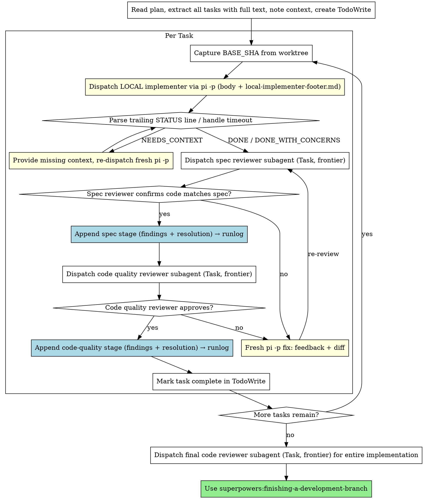

# Local-Subagent-Driven Development

A variant of **superpowers:subagent-driven-development**. Identical orchestration and identical
two-stage review — **the only change is who writes the code.** The implementer runs as a local
headless `pi -p` process inside the task worktree (free, local tokens) instead of a frontier
Claude Task subagent. Planning, both reviewers, and finishing all stay on the frontier, exactly
as the base skill configures them.

If you have not read **superpowers:subagent-driven-development**, read it first — every principle
there (fresh context per task, spec-then-quality review, continuous execution, never parallel
implementers, never skip review loops) applies here unchanged. This document repeats only what
differs.

**Core principle:** Frontier brain (plan + two-stage review), local hands (implement) — the
typing is free, the judgment is not.

**Continuous execution:** Same as base — do not pause to check in between tasks. Stop only on a
BLOCKED you cannot resolve, genuine ambiguity, or all tasks complete.

## When to Use

Use this instead of base subagent-driven-development when **all** of these hold:
- You have a well-specified plan with mostly independent tasks (same precondition as base).
- A local `pi -p` model is configured and reachable (see Local Dispatch Protocol).
- You want implementation tokens off the frontier meter.

If the local model isn't available, or the tasks need frontier-level reasoning to *implement*
(not just to review), use base **superpowers:subagent-driven-development** instead.

## The Process

Identical to base, except the implementer (initial dispatch and every fix re-dispatch) is a
local `pi -p` call instead of a Task subagent. Both reviewers remain Task subagents. Steward adds
two things on top: every dispatch carries the [Steward Dispatch Payload](#steward-dispatch-payload)
(issue + its Decisions & Defaults + `DECISIONS.md` + ledger protocol — deliberately not the brief),
and each resolved review stage is persisted to
the [runlog](#capturing-the-review-trail-runlog) instead of dying in-session (the two `→ runlog`
notes in the graph).



## Local Dispatch Protocol

This is the one section with no equivalent in the base skill. It defines exactly how the
implementer (and its fixes) run locally.

### Building the prompt

1. **Assemble the steward context pack** (see [Steward Dispatch Payload](#steward-dispatch-payload)
   below). This is the **settled** decision context the implementer needs to resolve ambiguity
   without asking: the issue body (with its Decisions & Defaults excerpts), the target repo's
   `DECISIONS.md` (if present), and this skill's `./ledger-protocol.md` — **and not the project
   brief** (see the section for why). It goes **first**, before the implementer body.
2. **Read the unchanged upstream implementer body** from the installed base skill:
   `superpowers:subagent-driven-development/implementer-prompt.md`. Use the text *inside* its
   `prompt: |` block — the same body you would have put in a Task subagent. Fill in Task
   Description (full text from the plan/issue), Context (scene-setting), and working directory
   exactly as the base template instructs. Do **not** copy or edit that file into this repo.
3. **Append this skill's footer**, `./local-implementer-footer.md`, verbatim. The footer
   reconciles the interactive base body with headless execution and defines the machine-parseable
   `STATUS:` contract. It stays last — it says "read this last."
4. Write the assembled prompt to a temp file and feed it to pi **on stdin**
   (`pi -p ... < "$PROMPT"`). Do **not** deliver it with `@file`: pi treats `@file` content as
   an untrusted *attachment*, not as the operator's prompt, and refuses to follow the instructions
   inside it — the run dies with a refusal instead of implementing.

   Argv (`pi -p "$(cat "$PROMPT")"`) is also a trusted channel and works for small packs, but it
   is **not** bounded by `ARG_MAX` (2MB) as you might assume: Linux caps any *single* argument at
   `MAX_ARG_STRLEN` = 32 pages = **131072 bytes**, and the whole prompt is one argument. Past that
   the exec fails with `E2BIG` before pi ever starts — which looks exactly like the silent no-op
   run described below, with an empty `out.txt` and no session file to diagnose. A fix re-dispatch
   appends a full `git diff "$BASE_SHA"..HEAD`, so this ceiling is genuinely reachable. Stdin has
   no such limit; prefer it always.

### Steward Dispatch Payload

This is steward's extension over the base skill: every dispatch (initial and every fix re-dispatch)
carries the **settled** decision context the implementer needs to resolve ambiguity without asking
— and **nothing more**. The controller assembles the pack; it is prepended to the implementer body
in this order:

1. **This issue** — the issue body being implemented, including its *Decisions & Defaults*
   excerpts, verbatim. Per the decomposition protocol each issue already carries the decisions
   relevant to *this* task; that excerpt — not the whole brief — is how settled decisions reach the
   implementer.
2. **Standing decisions** — the contents of the target repo's root `DECISIONS.md` if it exists;
   otherwise the literal line `DECISIONS.md: none yet — ledger every assumption` (graceful
   degradation, per `docs/DECISION-LIFECYCLE.md`).
3. **Decision & ledger protocol** — `./ledger-protocol.md` verbatim, the implementer-facing
   capsule of the decision lifecycle (resolution ladder, hard-stop class, ledger entry format).

**Deliberately *not* included: the project brief.** Injecting the whole brief works against the
point of decomposition — **context isolation**. The brief is where decisions get *argued*; by the
time an issue is dispatched, those decisions are *made*. Handing the implementer the brief invites
it to re-read and re-litigate settled choices — wasted effort at best, drift at worst. Settled
decisions must arrive **already settled**, as the issue's Decisions & Defaults excerpts and
`DECISIONS.md` entries, in directive form. If a decision the task needs is in neither, that is a
decomposition gap: the implementer takes a reversible default and ledgers it, or stops with
`NEEDS_CONTEXT` — it does **not** go spelunking in the brief. (Standing decision, steward
`DECISIONS.md` 2026-07-04; supersedes the "brief" item in issue #6 and brief C3.)

The issue and `DECISIONS.md` live in the **target repo**; `ledger-protocol.md` ships with this
skill so the protocol is present even when the target repo has no steward files yet. Assemble each
behind a clear `## ` heading so the implementer can tell them apart, e.g.:

```bash
CONTEXT_PACK=$(mktemp)
{
  printf '# Dispatch context (read before the task)\n\n'
  printf '## This issue\n\n';      cat "$ISSUE_BODY_PATH"
  printf '\n\n## Standing decisions\n\n'
  if [ -f "$WORKTREE/DECISIONS.md" ]; then cat "$WORKTREE/DECISIONS.md"
  else printf 'DECISIONS.md: none yet — ledger every assumption\n'; fi
  printf '\n\n'; cat "$SKILL_DIR/ledger-protocol.md"
} > "$CONTEXT_PACK"
```

### Invoking

```bash
PROMPT=$(mktemp)
{ cat "$CONTEXT_PACK";                            # steward payload: issue + DECISIONS.md + ledger-protocol (no brief)
  printf '\n\n%s\n\n' "$IMPLEMENTER_BODY_WITH_CONTEXT";
  cat local-implementer-footer.md; } > "$PROMPT"  # footer last — it overrides anything above that assumes a chat

cd "$WORKTREE"
BASE_SHA=$(git rev-parse HEAD)                 # capture BEFORE the run, for the quality reviewer

pkill -f '(^|/)pi -p' 2>/dev/null              # clear stray HEADLESS implementers only (see below)
timeout -k 10 --signal=TERM "$BUDGET_SECONDS" \
  pi -p --thinking low < "$PROMPT" \
  > out.txt 2> err.txt
rc=$?

# Tolerant parse: the model may emit a bare `STATUS: DONE` OR markdown `**Status:** DONE`
# (the upstream Report Format uses the bold form). Match either, normalise to upper-case.
STATUS=$(grep -ioE 'status:[*[:space:]]*(DONE_WITH_CONCERNS|NEEDS_CONTEXT|BLOCKED|DONE)' out.txt \
         | grep -ioE 'DONE_WITH_CONCERNS|NEEDS_CONTEXT|BLOCKED|DONE' | tail -1 | tr a-z A-Z)
HEAD_SHA=$(git rev-parse HEAD)                  # capture AFTER, for the quality reviewer
```

- **Model** — not specified on the command line. Pi's own config (`~/.pi/agent/models.json`)
  selects the local model; let it. Override only by editing that config, not this invocation.
- **`$BUDGET_SECONDS`** — a generous per-task wall-clock cap (start ~600–1200s; tune per plan).
  A week of smooth runs shows a slow `pi -p` is usually thinking, not hung — so budget long and
  let it work rather than killing early.
  `pi -p` has **no internal timeout**, so this wrapper is mandatory.
- **`--signal=TERM` with `-k 10`, never bare `--signal=KILL`.** This is critical. A hard SIGKILL
  severs pi mid-request and orphans **both** the pi process **and** the LM Studio server-side
  generation; the orphaned generation then wedges the local model so every *subsequent* dispatch
  hangs on its first inference (frozen, empty output) until you kill the strays. SIGTERM lets pi
  abort the generation and clean up its children; `-k 10` is a 10s backstop if it ignores TERM.
  The defensive `pkill -f '(^|/)pi -p'` before each dispatch clears any orphan a previous run
  left behind. (This was the single biggest failure mode in the e2e shakedown — see brief §11.)
- **Scope the pkill to headless runs — never `pkill -x pi`.** `pkill -x pi` matches *every*
  process named `pi`, including an interactive pi session the human has open in another terminal
  — it kills their session out from under them. The `-f '(^|/)pi -p'` pattern matches only
  print-mode (headless) invocations, which are the only ones this skill dispatches and therefore
  the only ones it may kill.
- **Keep the `(^|/)` anchor — do not "simplify" the pattern to `pkill -f 'pi -p'`.** `pkill -f`
  matches against every process's *full* command line, including the command line of the shell
  that is running this very dispatch script — which contains the literal text `pi -p`. The
  unanchored pattern therefore kills its own wrapping shell: the dispatch dies mid-script with a
  signal exit code (144 observed) and no output, and you will waste an afternoon blaming the
  model. The anchor saves it because in the wrapper's command line `pi -p` is always preceded by
  a quote, a space, or a newline — never by start-of-string or `/` — while a real orphan's
  command line begins with `pi -p` or `/path/to/pi -p`. That asymmetry is load-bearing.
- **`--thinking low` is the dispatch default, and always pass the flag explicitly.** The failure
  it guards against is a **runaway reasoning loop**: thinking tokens and output tokens come out of
  one fixed **16,384-token output budget**, and the model can spend the entire budget reasoning
  without ever emitting its first tool call. The run then exits "cleanly" — rc 0, no commits, no
  status line, nothing in `out.txt`. The signature in the session file is unmistakable:
  `"stopReason": "length"`, `usage.output` exactly `16384`, and a final message whose content
  parts are `['thinking']` and nothing else.

  **The burn is task-dependent, not simply level-dependent** — measured, not assumed. On one real
  implementation task, `xhigh` burned the full budget and `medium` burned it too; `low` completed.
  But on a trivial one-tool-call task, `high` finished in 37s using **71 output tokens with 64
  spent on thinking** — three orders of magnitude of headroom. So a higher level does not
  deterministically burn the budget; it raises the probability that a task the model finds hard or
  underspecified tips into the loop. Since dispatches here are real implementation tasks, default
  `low`. Climb the ladder (`off, minimal, low, medium, high, xhigh, max`) one rung at a time for a
  task that demonstrably needs it, and drop back on the first `length` stop.

  **Pass `--thinking` explicitly on every dispatch.** The level is read from
  `~/.pi/agent/settings.json` (`defaultThinkingLevel`) when the flag is absent, and on the
  reference host that default is `xhigh` — the exact setting that produced the burn. Never rely on
  the ambient config.

  Note that the level you dispatched with is **not** recoverable from the session file — the
  `thinkingLevel` it records tracks neither the flag nor the settings default (observed as `"off"`
  on runs dispatched at both `xhigh` and `medium`). Log the level in the runlog, or you cannot
  reconstruct which rung failed.

### Reading the result (spike + e2e hardened — see brief §11)

- **Normal exit (`rc == 0`):** branch on `$STATUS` per "Handling Implementer Status" below.
- **Timeout (`rc == 124`, or `143` if TERM-terminated):** `pi -p` **buffers all stdout until
  exit**, so a killed run yields empty `out.txt` even if work landed. **Do not trust stdout.**
  Inspect git instead: `git -C "$WORKTREE" log --oneline "$BASE_SHA"..HEAD` and `git status`. If
  commits landed and the tree is clean, salvage as `DONE_WITH_CONCERNS` and send to review (the
  reviewer is the real gate). Otherwise `pkill -f '(^|/)pi -p'`, then treat as `BLOCKED` and
  re-dispatch once with a larger budget; if it times out again, escalate. **A timeout is also your
  cue to clear orphans before the next dispatch**, or it too will hang.
- **Clean exit, but no commits and no output:** don't guess — read the **`stopReason`** from pi's
  session file. A no-output failure is opaque from the outside (empty `out.txt` looks identical
  for a refusal, a token-budget exhaustion, and a provider error); the session file is the only
  place the run says why it stopped:

  ```bash
  # Sessions are stored in a PER-PROJECT subdirectory (the cwd path, slugified) — a flat
  # ~/.pi/agent/sessions/*.jsonl glob matches nothing and silently yields an empty $SESSION.
  SESSION=$(find ~/.pi/agent/sessions -name '*.jsonl' -printf '%T@ %p\n' 2>/dev/null \
            | sort -rn | head -1 | cut -d' ' -f2-)
  grep -o '"stopReason"[[:space:]]*:[[:space:]]*"[^"]*"' "$SESSION" | tail -1
  ```

  Scope it to the worktree you dispatched into when other pi sessions may be running concurrently
  — `find ~/.pi/agent/sessions -path "*$(echo "$WORKTREE" | tr / -)*" -name '*.jsonl'` — otherwise
  "newest session anywhere" can hand you an unrelated project's run.

  Interpret it: a length/max-tokens stop means the output budget ran out — usually thinking burn
  (see `--thinking` above); lower the thinking level and re-dispatch fresh. An error stop means
  the provider/model faulted — check LM Studio, clear orphans, re-dispatch. An abort means
  something killed the run. Only after reading it do you pick between re-dispatch and escalation.
- **No `STATUS:` match on a clean exit (but work landed):** treat as `DONE_WITH_CONCERNS` and
  proceed to review — let the spec reviewer catch any gap. Never block the loop on a
  missing/garbled status line.

### Fix loop — fresh session, never resume

When a reviewer finds issues, **re-dispatch a fresh `pi -p`** — do **not** reuse `--session-id`.
(Spike §11: resuming a pi session that already holds tool-call history with tools enabled hangs
hard.) Statelessness is the rule, not a fallback. Give the fresh run enough to fix without prior
chat memory:

- The original task description (same body).
- The reviewer's specific findings (verbatim, with file:line references).
- `git -C "$WORKTREE" diff "$BASE_SHA"..HEAD` so it sees exactly what was built.
- The same footer (it will read current files in the worktree directly).

Dispatch the fix run with the **same Invoking discipline** as above (scoped
`pkill -f '(^|/)pi -p'` first, prompt on stdin not `@file`, `--thinking low`,
`--signal=TERM -k 10`, tolerant status parse). The fix prompt carries a full
`git diff "$BASE_SHA"..HEAD`, so it is the dispatch most likely to blow the argv ceiling —
another reason stdin is the default. After it commits, advance `HEAD_SHA` and re-review.
The cwd worktree guarantees commits land on the task branch.

### Convergence guard

A weak local model may not converge. **Cap the fix↔review cycles per reviewer at 3.** On
exhaustion, **stop and escalate to the human** with the diff and the outstanding findings — do not
keep bouncing or ship unreviewed code. (Acceptance: an oversized task surfaces here rather than
silently shipping.)

## Capturing the Review Trail (runlog)

In the base skill, per-task review happens in-session and the findings evaporate once the task is
marked complete. Steward **persists** them: both stages of every task's review — **findings and
their resolutions** — are appended to `.steward/runs/<issue>/runlog.md` in the worktree (path per
`docs/CONVENTIONS.md`; ephemeral and gitignored; folded into the PR's *Review trail* section by
the packaging skill, #9). This is what turns review from throwaway chatter into the verification
trail George reads instead of re-reviewing the diff.

**When:** after each review stage *resolves* — i.e. once the reviewer finally approves, after any
fix cycles. Record the whole exchange, not just the verdict.

**What each stage entry contains:**
- The stage name (**Spec compliance** or **Code quality**) and the task it covers.
- The reviewer's findings, **verbatim** (with the `file:line` references they gave). If the
  reviewer approved with no findings, say so explicitly — that is still a recorded result.
- The **resolution** for each finding: what changed and the fix commit sha, or why no change was
  needed. A finding with no resolution is an unfinished task, not a runlog entry.

Append as you go (create the dir/file if absent), so a mid-run crash still leaves a partial trail:

```bash
RUNLOG=".steward/runs/$ISSUE/runlog.md"
mkdir -p "$(dirname "$RUNLOG")"
cat >> "$RUNLOG" <<EOF
## Task: $TASK_NAME — Spec compliance
**Findings (reviewer, verbatim):**
$SPEC_FINDINGS
**Resolution:**
$SPEC_RESOLUTION   # fix sha(s) or "approved, no changes"
EOF
```

Do the same for the **Code quality** stage. Two stages per task means at least two runlog entries
per task; a task that needed fixes shows the finding and the fix sha side by side.

## Model Selection

The base skill tiers models and reserves the cheap/fast slot for mechanical implementation. Here,
local Pi **is** that slot:

- **Implementation (all of it):** local `pi -p`, with the model chosen by Pi's own config rather
  than this skill. v1 uses a single local model; tiering across local models is a later concern.
- **Spec review, code-quality review, final review:** Task subagents on the **most capable
  available model**, unchanged from base. A weak model reviewing a weak model's code is the thin
  spot in the loop — keep review on the frontier.

If a task genuinely needs frontier-level reasoning to *implement* (not just review), it does not
belong in this skill — run that task under base subagent-driven-development.

## Handling Implementer Status

Same four statuses as base, with local nuances:

**DONE:** Proceed to spec compliance review.

**DONE_WITH_CONCERNS:** Read the concerns first. Correctness/scope concerns → address before
review; observations → note and proceed. (Also the salvage status for a timed-out run that
nonetheless committed.)

**NEEDS_CONTEXT:** The headless run could not ask mid-task, so it stopped and listed what it
needs. Provide the missing context and re-dispatch a **fresh** `pi -p` (not a resume). This is the
local stand-in for the base skill's interactive question round-trip.

**BLOCKED:** Assess the blocker:
1. Context problem → provide more context, re-dispatch fresh.
2. Needs more reasoning than the local model has → this task likely belongs under base
   subagent-driven-development (frontier implementer); escalate to the human to reassign.
3. Task too large → break into smaller pieces.
4. Plan itself is wrong → escalate to the human.

**Never** force an identical re-dispatch with nothing changed, and never silently ship a run you
couldn't verify.

## Prompt Templates

This skill **owns no copy** of the upstream templates and **edits none of them** — that keeps
upstream pulls conflict-free and the most-likely-to-improve files shared.

- **Implementer body:** read at runtime from
  `superpowers:subagent-driven-development/implementer-prompt.md`. It is wrapped, not edited:
  the [steward context pack](#steward-dispatch-payload) is prepended and `./local-implementer-footer.md`
  appended.
- **Steward implementer-facing files (this skill owns):** `./local-implementer-footer.md` (headless
  STATUS contract, byte-identical to the fork) and `./ledger-protocol.md` (the ambiguity/ledger
  capsule that rides in the context pack).
- **Spec reviewer:** `superpowers:subagent-driven-development/spec-reviewer-prompt.md`, used as-is;
  its findings and resolution are appended to the [runlog](#capturing-the-review-trail-runlog).
- **Code-quality reviewer:** `superpowers:subagent-driven-development/code-quality-reviewer-prompt.md`,
  used as-is — it calls `superpowers:requesting-code-review` with `BASE_SHA`/`HEAD_SHA`, which the
  Local Dispatch Protocol captures from the worktree.

## Red Flags

Everything in the base skill's Red Flags applies. **Additionally, never:**

- **Reuse `--session-id` to resume a pi implementer for a fix** — resume + tools hangs hard.
  Fixes are always fresh stateless runs.
- **Run `pi -p` without a `timeout` wrapper** — it hangs indefinitely on model eviction and on the
  resume bug, with no error and no output.
- **Hard-kill pi with `--signal=KILL`** — it orphans the LM Studio server-side generation and wedges
  the local model for every following dispatch. Use `--signal=TERM -k 10`, and a scoped
  `pkill -f '(^|/)pi -p'` to clear any orphan before the next dispatch.
- **`pkill -x pi`** — it matches every process named `pi`, interactive sessions included, and
  kills the human's open session. Only ever kill headless print-mode processes.
- **Deliver the prompt with `@file`** — pi treats attached files as untrusted input and refuses
  to follow instructions inside them; the dispatch dies as a refusal. The prompt goes in on stdin.
- **Pass a large prompt as an argv argument** — a single argument is capped at 131072 bytes
  (`MAX_ARG_STRLEN`), not the 2MB `ARG_MAX`; past that the exec fails with `E2BIG` and never
  starts pi, which is indistinguishable from a silent no-op run. Stdin is unbounded.
- **Omit `--thinking`, or default it high** — the level otherwise comes from
  `settings.json` (`xhigh` on the reference host), and thinking shares one 16,384-token output
  budget it can consume entirely before the first tool call, producing a silent no-op run.
  `medium` was measured failing on a real task. Pass the flag explicitly; default `low`.
- **Unanchor the pkill pattern** — `pkill -f 'pi -p'` matches the dispatch script's own shell
  command line and kills the run from inside itself. Keep `(^|/)`.
- **Trust `out.txt` after a timeout** — stdout is buffered and lost on kill; judge progress from
  git state in the worktree.
- **Shrug off a no-output run as "the model failed"** — read `stopReason` from the newest session
  file first; it distinguishes thinking burn from a provider fault from an abort, and each has a
  different remedy.
- **Route either reviewer to the local model** — review stays frontier.
- **Keep bouncing a non-converging fix loop past the cap** — escalate to the human instead.
- **Dispatch local implementers in parallel** — same as base, conflicts.
- **Dispatch without the context pack** — an implementer that can't see the issue's decisions,
  `DECISIONS.md`, and the ledger protocol will guess instead of ledger. The payload is not optional.
- **Dispatch the whole project brief** — it breaks context isolation and invites re-litigation of
  settled decisions. Settled decisions arrive via the issue's D&D excerpts and `DECISIONS.md` only.
- **Let a review stage die in-session** — every resolved stage lands in the runlog, findings *and*
  resolution. An empty runlog after a reviewed task is a bug.

## Integration

**Required workflow skills (all unchanged from base):**
- **superpowers:subagent-driven-development** — the parent skill; read it first. This skill reads
  its prompt templates at runtime and inherits all its principles.
- **superpowers:using-git-worktrees** — isolated workspace; its path is the `pi -p` cwd.
- **superpowers:writing-plans** — creates the plan this skill executes.
- **superpowers:requesting-code-review** — review template the code-quality reviewer uses.
- **superpowers:finishing-a-development-branch** — complete development after all tasks.

**Local implementer uses:**
- **superpowers:test-driven-development** — the upstream implementer body already instructs TDD;
  it carries through to the local run.

**Steward context this skill reads (target repo + this skill dir):**
- The **issue body** with its Decisions & Defaults excerpts — the dispatch payload's task + settled
  decisions. (The project brief is deliberately **not** dispatched — see Steward Dispatch Payload.)
- The target repo's root **`DECISIONS.md`** if present — standing law (graceful degradation per
  `docs/DECISION-LIFECYCLE.md` when absent).
- **`./ledger-protocol.md`** — implementer-facing capsule of `docs/DECISION-LIFECYCLE.md`.
- **`docs/CONVENTIONS.md`** — defines `.steward/runs/<issue>/runlog.md` and the ledger path.

**Prerequisite:** a configured, reachable `pi -p` local model (`~/.pi/agent/models.json`).
